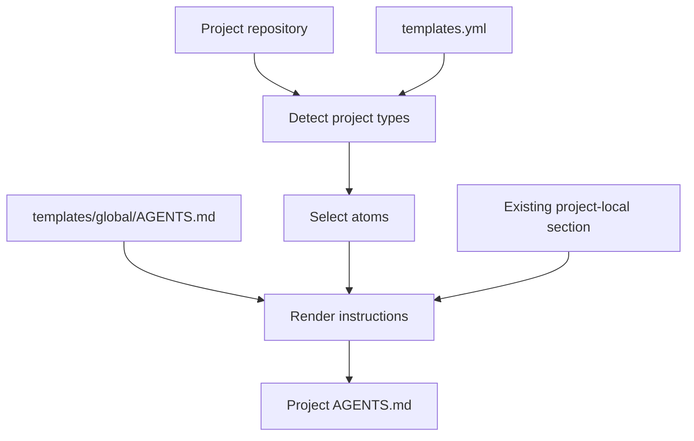
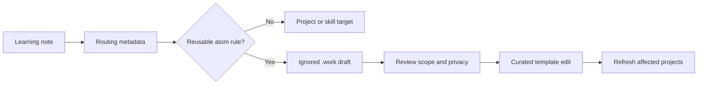

# Composable Agent Instructions

This repository is the source of truth for reusable instruction atoms and
generated project instruction files. The goal is to reduce duplicated rules
while keeping each project explicit enough for an agent to act reliably.

## Table of Contents

- [Model](#model)
- [Instruction Layers](#instruction-layers)
- [Composition Flow](#composition-flow)
- [Atom Taxonomy](#atom-taxonomy)
- [Source of Truth](#source-of-truth)
- [Upstreaming From Learnings](#upstreaming-from-learnings)
- [Learning Handoff Format](#learning-handoff-format)
- [Review And Apply](#review-and-apply)
- [Refresh Coverage](#refresh-coverage)
- [Failure Controls](#failure-controls)
- [Generation Policy](#generation-policy)

## Model

Project instructions should be generated from small reusable atoms plus a
preserved local section.

```text
global director policy
+ selected atoms
+ project-local rules
= project AGENTS.md
```

Generated project files may point to `${HOME}/AGENTS.md`, but they should not
depend on an agent recursively loading separate atom files at runtime. The
global director is referenced, reusable atoms are expanded, and project-local
rules stay in the preserved local section.

## Instruction Layers

| Layer | Purpose | Example Content |
| --- | --- | --- |
| Global director | Universal user policy | Communication style, validation, git boundaries |
| Atom overlay | Reusable project or task guidance | Python, CLI, Ansible, docs, infra runtime |
| Project local | Repo-specific facts | Commands, deployment boundaries, local workflows |
| Skill | Procedure | Review, remediation, debugging, template mining |

The global director should stay compact. Domain rules belong in atoms unless
they apply almost everywhere.

## Composition Flow



The generated output should keep provenance boundaries:

```text
<!-- BEGIN TEMPLATE: python -->
...
<!-- END TEMPLATE: python -->

<!-- BEGIN PROJECT LOCAL -->
...
<!-- END PROJECT LOCAL -->
```

## Atom Taxonomy

Current curated template IDs come from `templates.yml`. Proposed aliases are
target-state names for future splits when real recurrence justifies sharper
boundaries.

| Current Template ID | Scope | Proposed Future Split |
| --- | --- | --- |
| `generic-development` | Common project workflow | none |
| `python` | Packaging, imports, tests, entrypoints | `testing-validation` if test rules grow |
| `bash` | Bash, zsh, quoting, environment, linting | `shell` alias only |
| `cli` | Command design and credentials | `cli-tooling` |
| `ansible` | Roles, task includes, inventories, facts | `infra-runtime` for host/service rules |
| `workspace` | Workspace wrapper and harness behavior | `infra-runtime` |
| `docker` | Compose, containers, image safety | `infra-runtime` |
| `docs` | README, runbooks, public examples | `docs-release` |
| `github-release` | Release metadata and changelog flow | `docs-release` |
| `web` | Browser, UI, client behavior | `frontend` |
| `macos` | macOS app and local desktop workflows | none |
| `raspberry-pi` | Pi operations and device workflows | `hardware-device` |
| `home-assistant` | Home Assistant automation and staging | none |
| `hardware-device` | Authorized device, telemetry, diagnostics | none |

Proposed atoms not yet represented by a current template:

| Proposed Atom | Scope |
| --- | --- |
| `config-data-flow` | Schemas, generated files, URLs, identifiers |
| `security-boundaries` | Secrets, auth, privileged helpers |
| `data-persistence` | Migrations, stored files, backward compatibility |
| `agent-workflows` | `AGENTS.md`, `SKILL.md`, prompts, automation behavior |

Do not create an atom from one project-specific fact. Repeated recurrence or
clear cross-project reuse is the signal to split or add an atom.

## Source of Truth

| Artifact | Source of Truth |
| --- | --- |
| Curated atoms | `templates/**/AGENTS.md` |
| Template selection | `templates.yml` |
| Project-local rules | The project's preserved local section |
| Installed template skills | Copies or symlinks installed by this repo |
| Learning notes | The learning store managed by `agent-learning-system` |

Installed skill copies may know this repository path through local
`config/template_repo_path.txt` files. Those files are installation metadata and
must not be committed.

This repository owns regeneration from curated templates. Learning automation
can propose draft upstream changes, but approved template edits and project
refreshes happen through this repository's template workflow.

## Upstreaming From Learnings

The learning system should send reusable prevention rules here as draft-first
template updates.



Draft-first upstreaming means automation may write candidate material under
`.work/`, but curated templates are changed only by an explicit apply or review
step.

## Learning Handoff Format

This is the implemented draft handoff contract. The mining helper writes
`.work/matrix/`, `.work/drafts/`, and a summary for learning-specific upstream
drafts under `.work/learning-upstream/`.

```text
.work/learning-upstream/<lesson_family>.md
```

Each draft should contain:

| Field | Meaning |
| --- | --- |
| Lesson family | Stable dedupe identity from the learning system |
| Source note | Learning note filename, not a private absolute path |
| Proposed template | Current template ID or proposed atom alias |
| Candidate rule | Public-safe reusable rule wording |
| Prevention target | Generated instructions that should receive the rule |
| Detection target | Skill target if the rule also improves review |
| Privacy verdict | `clean`, `needs-scrub`, or `blocked` |
| Review status | `draft`, `approved`, `rejected`, or `deferred` |
| Refresh trigger | Projects or project types to regenerate after approval |

The owner of the draft is the consolidation run that creates it. The owner of
curated template edits is the explicit review/apply step.
Draft content must already be scrubbed; `needs-scrub` means the wording still
needs review before approval, not that private material may be stored there.

Summarize pending learning drafts with:

```bash
python3 skills/update-agents-file-templates/scripts/update_agents_templates.py \
  --template-repo . \
  --learning-upstream-summary
```

## Review And Apply

Curated templates are changed only by explicit apply:

```bash
python3 skills/update-agents-file-templates/scripts/update_agents_templates.py \
  --template-repo . \
  --apply-learning-draft ".work/learning-upstream/<lesson_family>.md"
```

The command above is a dry run. To write the targeted curated template, the
draft must have `Review status: approved` and `Privacy verdict: clean`, then run
the same command with `--apply`.

Approved draft rules are appended under `## Learned Rules` in the selected
curated atom/template. Existing matching bullets are not duplicated.

## Refresh Coverage

Generated project instruction files can be checked after atom changes:

```bash
python3 skills/init-agents-file/scripts/init_agents_file.py \
  --project "/path/to/project" \
  --check \
  --json
```

For broad refresh visibility, write an ignored report:

```bash
python3 skills/update-agents-file-templates/scripts/update_agents_templates.py \
  --template-repo . \
  --scan-root "/path/to/projects" \
  --out-of-sync-report
```

Reports are written under `.work/out-of-sync/`.

## Failure Controls

| Risk | Control | Status |
| --- | --- | --- |
| Duplicated rules | Skip matching learned bullets and audit composed output | Current |
| Wrong atom selection | Store selected atoms in generated project files | Current |
| Privacy leak | Run `scripts/privacy_scan.py` after curated edits; scan drafts before approval | Current |
| Overbroad rule | Keep it project-local or move to `needs-review` | Current |
| Underbroad rule | Promote repeated project-local rules into atoms | Current |
| Stale projects | Run generated-file checks and out-of-sync reports | Current |
| Agent misses atom | Expand atom content into generated project files | Current |

## Generation Policy

Generated project files should be explicit and refreshable:

- preserve project-local content;
- prefer placeholders such as `${HOME}` over personal paths;
- keep generated atom sections bounded by markers;
- do not copy private project values into curated templates;
- validate Markdown and run the privacy scanner after curated template edits;
- scan `.work/learning-upstream/` drafts before approval.
